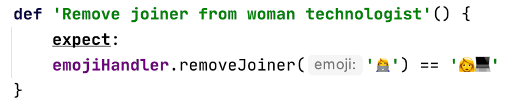
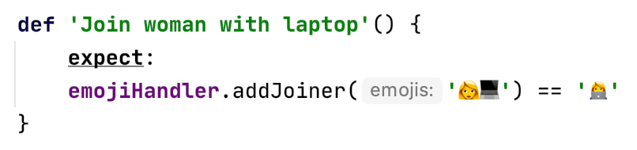
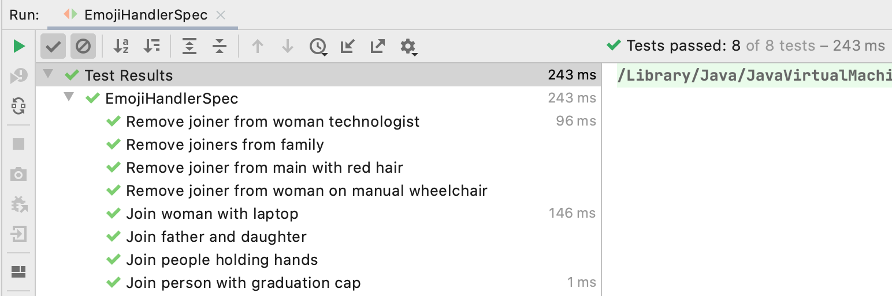

# Submission for SAP Community Coding Challenge #3

[](https://dev.azure.com/engswee/equalize-scc3-emoji/_build/latest?definitionId=7&branchName=master)

## Introduction
This repository contains the submission for the
[SAP Community Coding Challenge #3 (CCC3)](https://blogs.sap.com/2020/08/03/sap-community-coding-challenge-3/).
It contains a class that implements the two methods described in the challenge to handle removal and addition of Zero Width Joiner (ZWJ) in emojis.


## Solution Details
The solution is implemented in class [EmojiHandler](src/main/groovy/com/equalize/emoji/EmojiHandler.groovy). This class contains the following methods:
* String removeJoiner(String)
* String addJoiner(String)


Validation of the solution is implemented in Spock specification [EmojiHandlerSpec](src/test/groovy/com/equalize/emoji/EmojiHandlerSpec.groovy). Each test case in the Spock specification describes the input to the method call, and the expected output.

1. removeJoiner


2. addJoiner


## Test Execution
The repository is developed as a Maven project. Test execution is performed using a CI pipeline on Azure Pipelines.

For local execution, execute the Maven goal below:
```
mvn clean test
```

## Results



## Built With
* [Groovy](https://groovy-lang.org)
* [IntelliJ IDEA](https://www.jetbrains.com/idea/)
* [Maven](https://maven.apache.org)
* [Spock](http://spockframework.org)
* [GMavenPlus](https://github.com/groovy/GMavenPlus)
* [Azure Pipelines](https://azure.microsoft.com/en-us/services/devops/pipelines/)
* [emoji-java](https://github.com/vdurmont/emoji-java)